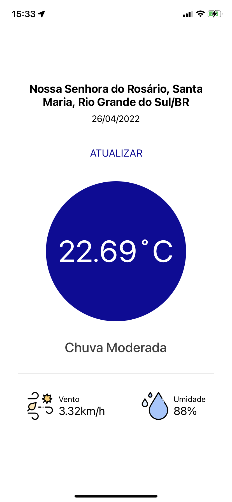

# ☀️ Desafio Técnico

🎯 Desenvolva um aplicativo que consuma a localização atual do usuário e exiba na interface o endereço atual os dados climáticos da região e um botão para atualizar os dados.

- Para fazer essa busca, pode-se usar a [API do Open Weather](https://openweathermap.org/api) Map.

## 📌 Condições

- Utilizar React Native
- É permitido o uso de outras libs
- Anexar `Print Screen` no Readme

---

## 📦 Outputs

- Repositório no [GITHUB](https://www.notion.so/GITHUB-4d23c6fae3f945bc82b7a3832f205d50)
- Documentação

---

## 🙌 Diferenciais

- Arquitetura
- Documentação
- Interface
- Testes

# Telas

Ao entrar na aplicação ela ira pedir permissão de localização, após isso ira para a tela de loading simples e ir para a screen mostrando os dados climáticos.



```
  - Os dados se atualizam ao clicar no botão atualizar
```

# Scripts:

### yarn

```
Instala dependências.
```

### yarn start

```
roda o projeto.
```

### yarn test

```
roda os testes.
```

# Stacks:

`expo`

`react`

`typescript`

`axios`

`react-testing-library`

# Arquitetura:

Criei o projeto através do create-react-app com o template do typescript. Dentro da pasta src foi onde alterei a arquitetura.

## Screens:

```
Armazena todas as telas do projeto com o seus módulos.
```

## Shared/Assets:

```
Local onde fica todas as imagens do projeto.
```

## Shared/Services:

```
Local onde configurei a minha chamada da api e criei os arquivos onde será feita as chamadas.
```

## Shared/Utils:

```
Local onde armazenarei todas as funções que podem ser reaproveitadas no projeto.
```
